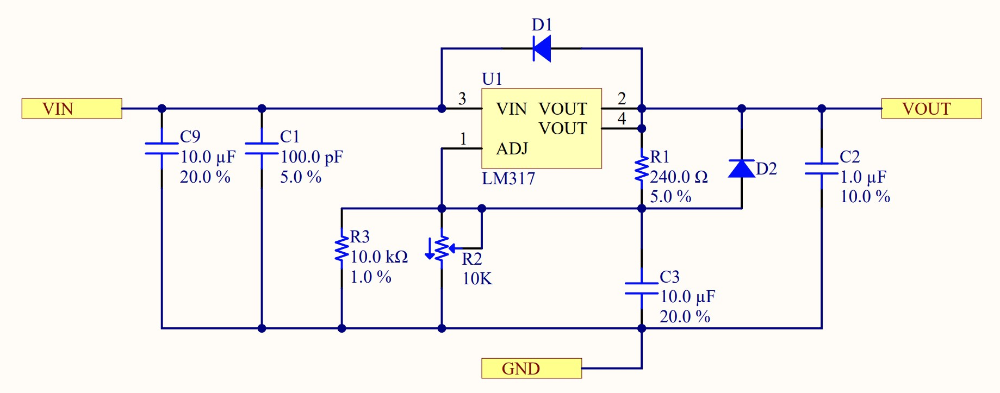

# ECE Modules PCB
 My PCB Project for Rowan's ECE Modules course.

As the semester progresses, this repository will include my schematics and PCB layouts from Altium Designer, as well as any MCAD and code necessary for my project.

## Using schematic sheets as hierarchical blocks in Altium Designer

Altium Designer allows users to create schematic sheets that can be turned into hierarchical blocks, allowing for easy design reuse, similar to creating a function when writing code.  To create a hierarchical block (called a sheet symbol in Altium), create a new schematic sheet in your project and add and connect all of the components that you wish to use in your block.  It should be noted that you can also put hierarchical blocks (known as sheet symbols) in your design as well.  Once you would like to use your sheet in a higher level schematic sheet, right click in the higher level sheet, and choose Sheet Actions > Create Sheet Symbol From Sheet, then select the sheet which you want to turn into a block.

Altium Designer allows users to create schematic sheets that can be turned into hierarchical blocks, allowing for easy design reuse, similar to creating a function when writing code.  To create a hierarchical block (called a sheet symbol in Altium), create a new schematic sheet in your project.  Add all of the components to that sheet that you wish to have inside of the sheet symbol.  Any power nets that you create in your schematic will automatically be linked to those nets in other sheets since power nets are global in Altium.  Net labels created will be local to the schematic sheet, and any ports in the sheet will be exposed on your sheet symbol to connect it to your higher level schematic.

Note the three ports (small yellow rectangles) on this schematic named VIN, VOUT, and GND.  These three ports will appear on the sheet symbol in the next step.  It's important to note that ports can be used for any kind of signals, not just power.

When you are ready to turn your schematic into a block, right click in the higher level sheet where you want to place the block and choose Sheet Actions > Create Sheet Symbol From Sheet, then select the sheet which you want to turn into a block.

Once the block appears, you can rearrange all of the ports in a way that makes sense for your design, as well as resize the block itself by clicking and dragging the corners.  If you don't like the default green color, you can disable it in the properties panel under "Fill Color".

Once your sheet symbol is created, you will see that the sheet that the symbol was created from becomes nested under the sheet that the symbol is in.  In my example below, I created a sheet symbol from both sheet number 2 and 3, which you can see are now nested under sheet 1.  If the sheets are nested as shown, then you are finished!

## Power Supply Schematic - Fixed 3.3V Regulator AZ1117IH

This schematic block uses an AZ1117IH-3.3TRG1 3.3V 1A linear voltage regulator with SOT223 package.  The design includes bulk and bypass capacitors on both the input and output of the regulator to help eliminate current spikes and noise.

The datasheet for the AZ1117I can be found on the Diodes Inc website [here](https://www.diodes.com/assets/Datasheets/AZ1117I.pdf).  From reading the datasheet, there is a manufacturer provided typical application circuit as seen below.

My implementation uses two 10uF capacitors in place of the 22uF capacitor because we only stock ceramic surface mount capacitors up to 10uF.  I also added 0.1uF bypass capacitors on both the input and output of the regulator to help reduce noise.

## Power Supply Schematic - Variable Regulator - LM317

The variable power supply design is based around the LM317 adjustable linear voltage regulator.  The specific version used here is the LM317DCYR from Texas Instruments.

After looking through the [LM317DCYR Datasheet](https://rocelec.widen.net/view/pdf/mlzstqhekh/slvs044x.pdf?t.download=true&u=5oefqw), I settled on using the typical application schematic for my adjustable regulator design.  This design has a few more components than necessary such as the diodes D1 and D2, but they are a good idea to help prevent Cadj and Co from discharging onto the output of the regulator.

## Top Level Sheet

Once the voltage regulation sheets were completed, I turned them into schematic blocks (sheet symbols) using the instructions [above](#using-schematic-sheets-as-hierarchical-blocks-in-altium-designer).  I then moved the ports around, connected the global power nets to the ports, and added parameter sets (the red i bubbles) to all of the global power nets for later use.  These allow the creation of PCB design rules that specify trace thickness and other parameters differently than standard signal traces.

